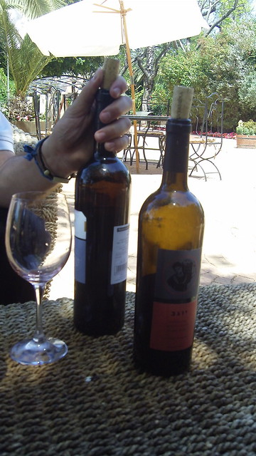

# CBottle Project
CBottle project is a project for the seminar course 'Computer Vision by Deep Learning'. The project is made to
identify bottles in an image and map them to a certain SKU based on the wine webshop. 
[Grandcruwijnen](https://www.grandcruwijnen.nl). The end goal is for a user to be able to take a picture
of one or more bottle(s) and have the pipeline identify the wines and be able to link you to the website's
url for that specific wine.

## The Pipeline

A modified MaskRCNN model -> x wine bottle masks -> nearest neighbour classifier using sift/surf/orb

First The user takes a picture: 

## Step 1 - Use MaskRCNN
First off we use a custom trained version of MaskRCNN to do instance segmentation just on bottle instances
where we prefer instances with wine images. We do this by using transfer learning on the COCO_MS weights provided
on the repository of the MaskRCNN model by extracting the training/evaluation set that contains bottles.

We can do some further domain transfer by then training these weights on augmented data where our bottles
are placed in COCO images where there is a bottle identified. We cut out the bottle/mask from this image
and paste in our bottle the any way we want it. We try to augment the data as accurately as possible
by only using masks where the mask size and proportions are similar to those of the bottle mask extracted
by the original maskRCNN.

At the end of this step, we have a model that can cut accurately cut out wine bottles out of images
and also prevent from cutting out other types of bottles that coco identifies as bottles 
(Water bottles, beer bottles, etc...). This model is the first step in the pipeline such that
we 