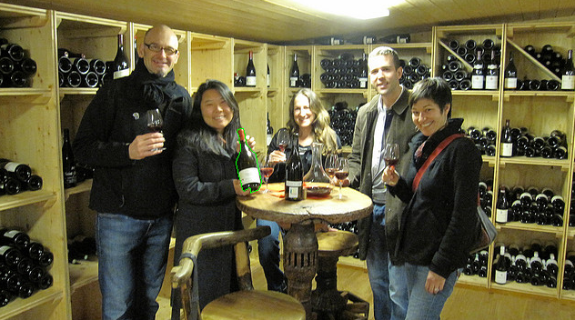

# CBottle

## Authors

- Jasper Ketelaar, j.ketelaar@student.tudelft.nl, 4453050
- Matthijs van Wijngaarden, m.c.vanwijngaarden@student.tudelft.nl, 4271785

## Introduction

CBottle is a project for the seminar course 'Computer Vision by Deep Learning'. The task for the course is to devise our
own computer vision project. The project is inspired by , a wine webshop that has a very
nice mobile application which is able to identify wine based on its label. The exact technology used by vivino is not
publically available and we aim to take our own approach based on the techniques we learn during the seminar course.

The end goal is identify bottles in an image and map them to a certain SKU based on the wine webshop.
[Grandcruwijnen](https://www.grandcruwijnen.nl). Then a user is able to take a picture of one or more bottle(s)
and have the pipeline identify the wines and be able to link you to the website's url for that specific wine.

We are primarily going to focus on the computer vision/deep learning aspects but will try to have a working base version
of the complete pipeline as well.

## Dataset

We have a dataset available to us that consists of high quality pictures of bottle from the Grandcruwijnen website.
These pictures are taken from multiple angles in optimal lighting conditions. The dataset is a lot more sparse than
Vivino who are in possession of a massive community taking a lot of pictures of wine labels and can therefore take a
different approach to bottle identification.

## Roadmap

The following section will detail the roadmap of this project, including what was discussed with our TA and what path we
took from there.

The first thing we looked at when we designed our project plan was how to approach it using existing techniques. The
task of object detection and object classification were two separate fields of computer vision, and in a way needed to
be integrated within one system. On top of this, we realized that the system we were designing would need to be trained
on a wide dataset but used in practice on novel images, taken by the user. As a result, our eyes fell upon the concept
of transfer learning to tackle this issue.

The dataset used in our system is the COCO dataset, with training and validation from the 2017 set to be exact. This
dataset was chosen due to its rich annotation and use of a ‘bottle’ label, which is very effective to have for training
on wine bottles. However, as mentioned earlier, target images would be images taken by user’s cellphones. These images
would be of lesser quality, worse angles and, of course, unlabeled. As a result, we deduced and discussed with the TA
that we would have to solve a system under the ‘Domain Adaptation’ clause. Much of our future design choices and
implementation thereof was influenced by with this fact in mind.

Before delving deeper into the design choices within our predictor’s architecture, we discussed during meetings what our
best base architecture would be. Our eyes quickly, and logically, fell upon the Mask R-CNN [1] architecture. One reason
was the prior use of it for specifically tackling the domain adaptation problem [2], another reason was the fact that it
was also used as the base architecture for an application that only aimed to detect one class, balloons, as well [3],
and the final reason was the fact that it could generate masks of wine bottles, which would come in handy later.

This architecture is an extension of the Faster R-CNN with the addition of generated masks for instance segmentation,
among a few other quality additions. Since our goal was to ultimately detect objects, there is a likelihood a user would
photograph more than one wine bottle at a time. The segmentation part of the architecture is designed for detecting more
than one instance of the same class, and the masks generated by the predictor would eventually help the classifier too.
The idea was that these masks would be ‘cut’ from the original image and used as input in the classifier.

We discussed with our TA whether to use a CNN for the final classification of different wines or whether to use keypoint
feature detection algorithms. The main point that we were worried about was the cost of learning for the dataset we used
since it would need to be able to be dynamic in its classification as new wines are added and older wines are disabled.
After discussing this with our TA we decided that keypoint detection would be the best way to solve this problem since
it is more dynamic and less time costly. The keypoint detection technique we ended up going for is SIFT after reading
research done on different techniques [4].

For the Mask-RCNN we needed to teach the network to separate any 'non-wine bottle' from a wine bottle. When discussing
this with the TA we actually found out that there could be an interesting research question in this: "Can a pretrained
network passively forget parts of how it detects a class?". It was discussed during meetings that the best way to tackle
the issue of unlearning redundant types of bottles was to find images that contain both a wine bottle and a non-wine
bottle and teach the network to only predict the wine bottle as a bottle and punishing it for mispredicting a different
bottle as a bottle.

We discussed ways on how to improve our predictor’s accuracy and focused on the idea of using augmentation of
the original image with pictures of wine bottles. Since the segmentations of the dataset were available we discussed
that we could use these as the basis for our augmentation as we could cut out the mask and try to fit in one of the
images from our dataset. We produced an interface to help us with this as we still decided that since these
augmentations could cause context problems. 

Some of the discussions with our TA will also come back in the following sections.

## Methodology

The final methodology we took to achieve the results of this project is a pipeline of approaches. We will describe the
approaches in terms of a pipeline both when it comes to the challenges for learning and the challenges for
implementation. The first challenge we faced after discussion with our TA is that the dataset we want to use does not
have that many images for each wine (12 construction a 360 degree presentation) and is taken in perfect lighting
conditions. We therefore discussed how to go about implementing this and we landed on a transfer learning approach using
data augmentation.

### Augmentation

We need to use our perfect scenario bottle images to augment into more contextual situations that a user would actually
take a bottle in. To do this we wrote an augmentation implementation using MaskRCNN and the OpenCV library for Python.
The augmentation takes a pre-trained version of MaskRCNN on the COCO dataset and uses that to detect all different sorts
and types of bottles in our handpicked augmentation base set from the dataset.

The augmentation base images are then used to augment a random selection of bottles into such that there are now wine
bottles where the other sorts of bottles used to be. The idea behind this augmentation to create a training set is that
we can use it to create a custom MaskRCNN model that is capable of detecting different sorts of wine bottles and find
their mask.

We created an interface to manually select the augmentation results that are good and seem contextually possible to
prevent the MaskRCNN model picking up on artifacts of bad augmentation using our method such as a lot of black pixels
due to a bottle not quite fitting in the cut out mask. After discussing with our TA we found out that we need to take
care not to create any other context associations through augmentation and have to take care this is not present in our
dataset for training. An example given to us of such a context association is there being a base image of a fridge that
only fits the augmentation of a more thick bottle; such an augmentation could then cause a model to perhaps learn that a
fridge means there must be a thick wine. We therefore make sure to try and select a subset of wines with variable shapes
and create enough different augmentations of the same base context.

An example of a base image and good augmentation:

An example of a base image with bad (and funny) augmentation:

### The MaskRCNN model

We make use of MaskRCNN as the basis for our wine bottle detection. Since the pretrained model has a class that already
encapsulates the class we wanted but not as specific as we want, we found an interesting research question with help
from our TA: **Can a pretrained network passively forget parts of how it detects a class?**

The approach we take with our augmented dataset is to also find images that contain different types of bottles that the
pre-trained network recognizes as the bottle type. These images are then augmented to contain a) a wine bottle and b) a
different bottle type such that the network will be forced to train to recognize the wine bottle as a wine bottle and
not recognize the other bottle type as a wine bottle. This is the passive approach we describe in the previous
paragraph. An active approach would be to take the pretrained model and create two classes instead of 1 class (excluding
the background class), these two classes would then be "wine bottle" and "other bottle" such that you could actively
train the network to learn to recognize them separately. We wanted to take the passive approach as the active approach
has already seen plenty of research and this passive approach could find some interesting results that would be of
value.

The MaskRCNN model is used to cut out the wine bottle masks which are fed to the next step of our complete application
pipeline. We discussed with our TA why we wanted to use keypoint detectors as a solution to the initially posed problem
rather than a classification network. The reason that we agreed on is that the problem requires a model that can easily
be modified to include/exclude wines that were previously a part of the classification process, since there is a
frequent rate of this happening. The company has an almost daily change in this, new wines get added frequently and old
wines get disabled frequently.

### Keypoint Detectors

The keypoint detectors idea is an effective way to use the cropped out bottle masks. The main keypoint detectors we
researched for our approach were SIFT, SURF, ORB and BRIEF. Since SIFT is scale invariant and implemented readily
available in the OpenCV library this was the model we ended up going with. We need to have a model that is flexible to
changes and keypoint descriptor vectors can be stored and indexed rather efficiently.

We use the base images from our wine bottle dataset to create an index tree in the FAISS \[ref] library. We created a
process that can produce such an index by downloading all the images for the active store, computing the descriptor
vectors using the SIFT method and indexing these to a specific ID that can be mapped back to the product SKU of the
store.

Then for the pipeline we forward the MaskRCNN wine bottle mask with the highest score (for when multiple wine bottles
are detected) to the keypoint detection stage. At this stage we perform keypoint detection only on the image pixels that
fall within the mask such that no background information is used for the matching of the bottles. The keypoint
descriptors are forwarded to the indexed model where a nearest-neighbour search is performed. Since the descriptors are
separate the nearest-neighbour results are aggregated as a list of ids, counts where the ids can be mapped to a wine sku
and the counts are how often that id is encountered as the nearest neighbour. The highest count nearest neighbour is
then returned as the result by the model and this is the result that can then be used to be sent back as a server
response in order to complete the implementation of the complete problem described in the introduction.

## Results

The general results of this project are a bit hard to truly evaluate as there is no benchmark standard to compare it
against and the set of bottles that we aim to classify are specific to our dataset. The best evaluation we can do for
the complete model is an evaluation of the results of the intermediate stages.

### Augmentation

The results of the augmentation are a few examples of photos of the augmentation code in this repository..

As was clear for an example posted before, the augmentation performs best when augmenting into a bottle shape that fits
the wine bottles and does not require some crazy stretching like in this example:

Another artifact that we found was the unblurring of a background by augmentation, an example:

These along with shape errors were not included in our training set for reasons discussed in the methodology.

### MaskRCNN

This is the most interesting part of the results. We trained the model on a collection of both augmented images and base
images that were from before augmentation. The results also aim to answer the question: "Can a pretrained network
passively forget parts of how it detects a class?". The specific settings for which we trained the network can be found
within the code.

As you can see the bottles that the network detect vary from many different types from milk cartons to candle holders to
jars of peanutbutter to water bottles. We hypothesised that as the network performs more training these class specifics
will be forgotten more quickly depending on how close shape/texture information relates to that of a wine bottle. By
this we mean to say that a jar of peanutbutter should no longer be classified after less epochs than a luxurious bottle
of water that resembles the shape of a bottle.

In the intermediate results that we explored of this network after different epochs of training we found our hypothesis
to hold. We took a model that trained for 10 epochs, a model that trained for 20 epochs and a model that trained for 30
epochs to see these results. We also included the results of the base model for comparison which is simply a model
trained for 0 epochs. We took these intermediate results since when training the model we found that the gain in
performance starts declining after 30 epochs and we do not want to overfit on our training/evaluation set.

To measure the performance we tested 100 images that we knew had no wine bottle in it to see after how many epochs the
model started dropping it as a predicted wine bottle:

The results describing the percentage:

| 0 epochs | 10 epochs | 20 epochs | 30 epochs |
|----------|-----------|-----------|-----------|
| 0%   | 57% | 65% | 70% |

The decline in the percentage difference between the epochs actually matches quite nicely with the decline of the loss
function. We do note that obviously a test set of 100 images is not enough to really make a statement but since we only
encountered this hypothesis later during our project and the images had to be manually picked we did not have time to
research this as much as we could have. When checking out which type of images were still getting recognized as bottle
we noticed that they were more varied in shape than we expected them to be. Our hypothesis of the model getting better
at objects that to us seem more clearly not a wine bottle was not necessarily reflected in this subset. We are not sure
if that is simply an artifact of a low sample size and it could have simply been that or that it means there were
different aspects that the network had a harder time 'passively forgetting'.

### Keypoint Detector

To evaluate the keypoint detector results we look at the results of a set of images taken using our phone cameras that
we know to be within the dataset of our available wines. We also check the cost of the complete indexing process as we
propose a model that is able to be re-index on a daily basis to be able to deal with the variability that is present in
the nature of the problem.

The performance of the model is enhanced by being able to index on the GPU using the FAISS library. The indexing process
takes on average ~0.25 seconds per image. When considering a dataset of approximately ~2500 images this comes out to be
just over 10 minutes on our local machines. This is an acceptable amount of time to us as a required cost at most every
day.

The detection performance was quite strong on our test set of images that we collected, but the sample size was still
rather low and the images were taken with care and might not completely reflect how a user who does not understand the
workings of the system may take a photo. We got an accuracy of 83.33%, or 25 out of 30 images correct.

## Conclusion

The project was a great learning experience for the field of computer vision and the evolution of the solution came from
knowledge taken away from seminar lectures and papers we read.

We took a few twists and turns when it comes to the direction of the project. This ended up being a good thing and made
us look at different aspects of computer vision in an engaging way. It did unfortunately make it a bit difficult to get
an evaluation set large enough to make very strong statements about our results.

The resulting pipeline at least performs well on the test set we were able to gather ourselves. We found an interesting
research question that our TA helped us focus on towards the end of the project as well. The question of passive
forgetting in deep learning networks is definitely interesting, and it was nice to see that we were able to provide some
basis for an actual answer.

It would definitely be interesting to do further research with different types of networks and datasets to figure out
how this idea applies to different network structures and data structures.

## Acknowledgements

We thank Jan van Gemert for the course and for suggesting Jasper to work on this project idea for this course in an
e-mail exchange. We thank Nergis Tömen for guiding us through this project as our TA and helping us focus on the right
direction during our weekly meetings.

## References

- [1]: Kaiming He, Georgia Gkioxari, Piotr Dollár, Ross Girshick (2017). Mask R-CNN.
- [2]: Chen, Y.; Li, W.; Sakaridis, C.; Dai, D.; and Gool, L. V. 2018. Domain Adaptive Faster R-CNN for Object Detection
  in the Wild. In CVPR
- [3]: Waleed Abdulla (2018). Splash of Color: Instance Segmentation with Mask R-CNN and TensorFlow
- [4]: Ebrahim Karami, Siva Prasad, Mohamed S. Shehata (2017). Image Matching Using SIFT, SURF, BRIEF and ORB:
  Performance Comparison for Distorted Images

## Work division

We primarily did work for this project in form of pair programming and discussion, and so we felt that it was hard to
attribute contributions to one person. Neither of us take issue with stating this, and we agree that we both contributed
an equal amount.